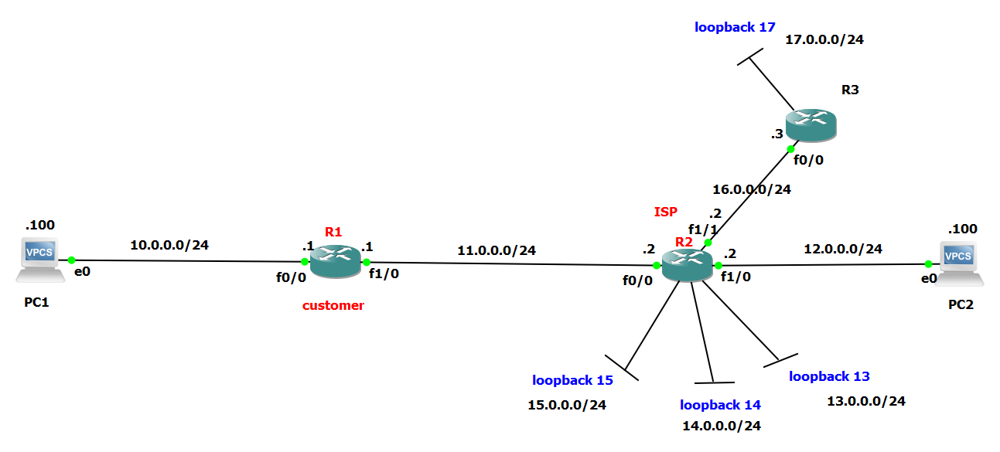

Markdown

# Lab 2: Cisco Default Routing & Service Provider Connection

## 📝 Objective
The objective of this lab is to establish end-to-end connectivity between a **Customer Network** and external subnets through a **Service Provider (ISP)** using **Default Routing (`0.0.0.0 0.0.0.0`)**, while ensuring explicit return paths for bidirectional communication.

## 🗺️ Topology


## ⚙️ Key Configuration Commands

### Customer Router (R1)
Forwarding all internal and unknown internet-bound traffic to the Service Provider:
```text
Customer-Router(config)# ip route 0.0.0.0 0.0.0.0 [ISP_Next_Hop_IP]

Service Provider Router (R2)

Forwarding outbound traffic to Router 3 while maintaining explicit return routes back to the Customer LAN:
Plaintext

ISP-Router(config)# ip route 0.0.0.0 0.0.0.0 [R3_Next_Hop_IP]
ISP-Router(config)# ip route [Customer_LAN_Network] [Subnet_Mask] [Customer_Next_Hop_IP]

Router 3 (R3)

Directing return traffic back to the Service Provider:
Plaintext

R3(config)# ip route 0.0.0.0 0.0.0.0 [ISP_Next_Hop_IP]

✅ Verification & Troubleshooting

End-to-end connectivity was verified using the following steps:

    Routing Table Inspection: Executing show ip route on all routers to confirm active Gateway of last resort entries (S*).

    Ping Tests: Verifying ICMP reachability from Customer LAN PCs to R3's virtual interfaces.

    Path Tracing: Executing traceroute from end devices to trace packet forwarding across the provider network.

Note: Complete device configurations and cabling details are available in the attached config.txt file.
