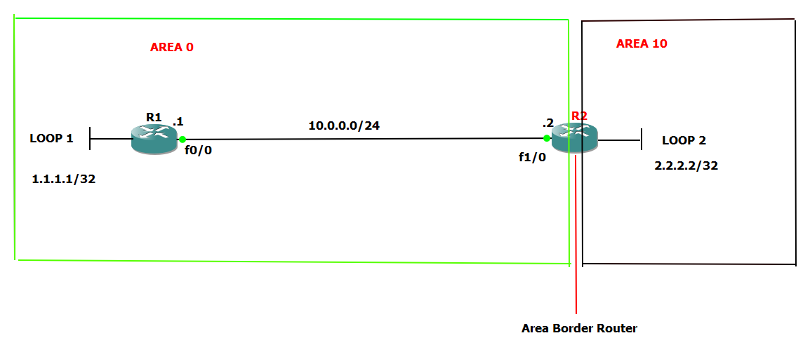

Markdown

# Lab 3: Multi-Area OSPF Dynamic Routing & ABR Configuration

## 📝 Objective
The objective of this lab is to transition from static routing to dynamic routing by implementing **OSPF (Open Shortest Path First)** across a multi-area network topology. This lab demonstrates dynamic neighbor adjacency, route propagation, and the role of an **Area Border Router (ABR)** connecting different OSPF areas.

## 🗺️ Topology


## 🔑 Key OSPF Concepts Demonstrated
- **Backbone Area (Area 0):** The central core area that all other OSPF areas connect to for inter-area traffic exchange.
- **Area Border Router (ABR):** Router 2 acts as an ABR connecting Area 0 and Area 10, maintaining separate Link-State Databases (LSDB) for each area.
- **Loopback Interfaces:** Configured as stable virtual subnets to simulate end-host networks and test end-to-end reachability.

## ⚙️ Key Configuration Commands

### Router 1 (Backbone Router - Area 0)
Configuring OSPF process and advertising connected networks into Area 0:
```text
R1(config)# router ospf [Process_ID]
R1(config-router)# router-id [R1_Router_ID]
R1(config-router)# network [Network_Address] [Wildcard_Mask] area 0

Router 2 (Area Border Router - ABR)

Configuring OSPF interface advertising across both Area 0 and Area 10:
Plaintext

R2(config)# router ospf [Process_ID]
R2(config-router)# router-id [R2_Router_ID]
R2(config-router)# network [Area_0_Network] [Wildcard_Mask] area 0
R2(config-router)# network [Area_10_Network] [Wildcard_Mask] area 10

✅ Verification & Troubleshooting

End-to-end connectivity and OSPF convergence were verified using:

    Neighbor Adjacency Check: Executing show ip ospf neighbor to confirm FULL/DR or FULL/BDR state between R1 and R2.

    Routing Table Inspection: Running show ip route to confirm OSPF-learned routes (O for Intra-area and O IA for Inter-area routes).

    ICMP Ping Test: Executing successful ping from R1 to R2's Loopback2 interface across Area 10.

Note: Complete device CLI configurations and topology files are available in the attached config.txt file.
