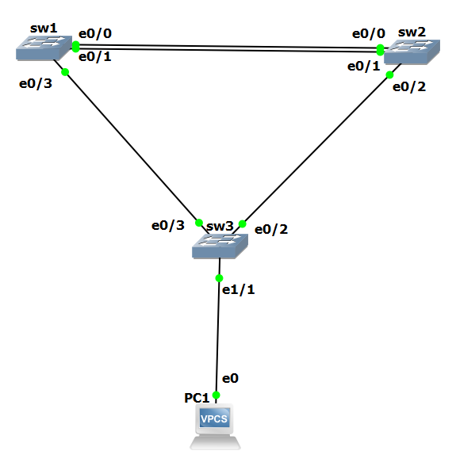

Markdown

# Lab: Layer 2 EtherChannel (LACP) & Rapid PVST+ Topology Convergence

## 📝 Overview
This lab demonstrates the implementation of **LACP EtherChannel** integrated with **Rapid PVST+** across a 3-switch redundant topology. It illustrates how Spanning Tree Protocol (STP) dynamically recalculates Root Path Costs when physical uplinks are aggregated into a logical interface.

## 🗺️ Network Topology & STP States

⚙️ Key Technical Insight

    Cost Shift Effect: Bundling physical uplinks into Port-Channel 1 lowered the root path cost between SW1 and SW2.

    STP Convergence Result: STP selected SW3 to maintain active forwarding (FWD) paths on its trunk links, forcing SW2 to put its Port-Channel 1 into Alternate/Blocking (BLK) state to maintain a loop-free Layer 2 topology.

💻 CLI Configuration Summary
SW1 (Primary Root)
Plaintext

interface range <trunk-interfaces-to-SW2>
 switchport trunk encapsulation dot1q
 switchport mode trunk
 channel-group 1 mode active

interface port-channel 1
 switchport mode trunk

interface <trunk-interface-to-SW3>
 switchport trunk encapsulation dot1q
 switchport mode trunk

spanning-tree mode rapid-pvst

SW2 (Secondary Root)
Plaintext

interface range <trunk-interfaces-to-SW1>
 switchport trunk encapsulation dot1q
 switchport mode trunk
 channel-group 1 mode active

interface port-channel 1
 switchport mode trunk

interface <trunk-interface-to-SW3>
 switchport trunk encapsulation dot1q
 switchport mode trunk

spanning-tree mode rapid-pvst

SW3 (Access Switch & Endpoint Security)
Plaintext

interface range <trunk-interfaces-to-SW1-and-SW2>
 switchport trunk encapsulation dot1q
 switchport mode trunk

spanning-tree mode rapid-pvst

interface <endpoint-interface-to-PC>
 switchport mode access
 
 spanning-tree portfast
 spanning-tree bpduguard enable

✅ Verification

    EtherChannel Status: Running show etherchannel summary confirms Po1(SU) status on SW1 and SW2.

    STP Verification: Running show spanning-tree verifies a loop-free state where SW3 maintains full FWD state on its trunk links while SW2 blocks its Po1 logical interface.
