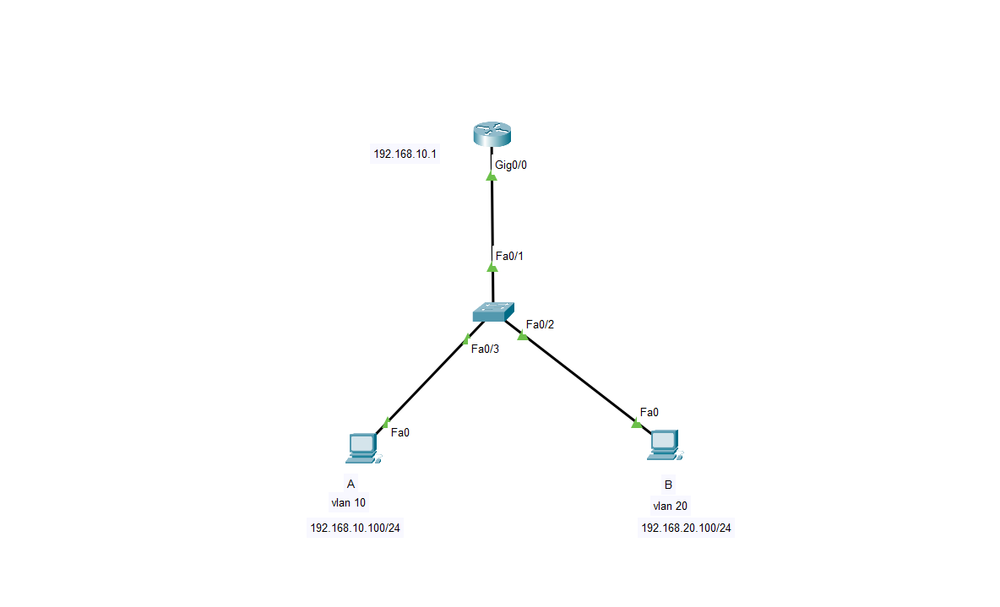

Markdown

# Lab 4: Inter-VLAN Routing & 802.1Q Trunking (Router-on-a-Stick)

## 📝 Objective
The goal of this lab is to achieve Layer 2 network segmentation using **VLANs** and enable controlled Layer 3 inter-communication using **802.1Q Trunking** and a **Router-on-a-Stick** architecture in GNS3.

## 🗺️ Network Topology


## 🔑 Key Concepts Implemented
- **Layer 2 Segmentation:** Created VLAN 10 and VLAN 20 to isolate broadcast domains and enhance network security.
- **802.1Q Trunking:** Configured a trunk link between the Switch and Router to encapsulate and transport multi-VLAN traffic across a single physical link.
- **Router-on-a-Stick (ROAS):** Configured logical sub-interfaces on the router to act as default gateways for each respective VLAN.

## ⚙️ Configuration Summary

### 1. Switch Configuration (VLANs & Trunking)
```text
! Creating VLANs
Switch(config)# vlan 10
Switch(config)# vlan 20

! Assigning Access Ports
Switch(config)# interface [Access_Interface_1]
Switch(config-if)# switchport mode access
Switch(config-if)# switchport access vlan 10

Switch(config)# interface [Access_Interface_2]
Switch(config-if)# switchport mode access
Switch(config-if)# switchport access vlan 20

! Configuring Trunk Link to Router
Switch(config)# interface [Trunk_Interface]
Switch(config-if)# switchport mode trunk

2. Router Configuration (Inter-VLAN Sub-interfaces)
Plaintext

Router(config)# interface [Physical_Interface]
Router(config-if)# no shutdown

! Sub-interface for VLAN 10
Router(config)# interface [Physical_Interface].10
Router(config-subif)# encapsulation dot1Q 10
Router(config-subif)# ip address [VLAN10_Gateway_IP] [Subnet_Mask]

! Sub-interface for VLAN 20
Router(config)# interface [Physical_Interface].20
Router(config-subif)# encapsulation dot1Q 20
Router(config-subif)# ip address [VLAN20_Gateway_IP] [Subnet_Mask]

✅ Verification & Results

    Trunk Verification: Verified active trunking status and allowed VLANs using show interface trunk.

    Inter-VLAN Reachability: Successfully executed end-to-end ping tests between hosts in VLAN 10 and VLAN 20 through the router's sub-interfaces.


---
