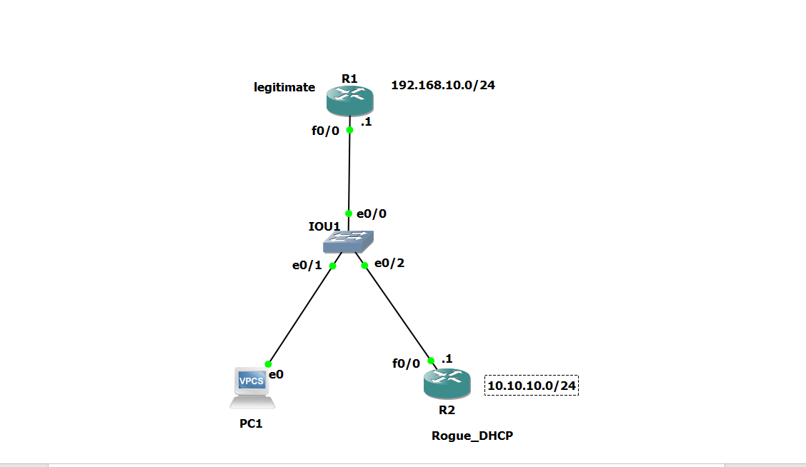

Markdown

# Lab 2: Mitigating Rogue DHCP Servers & L2 Hardening via DHCP Snooping

## 📝 Overview & Objective
This lab addresses one of the most common Layer 2 infrastructure vulnerabilities: **Unlawful or Rogue DHCP Servers**. Leaving access ports unmonitored allows unauthorized devices or attackers to distribute rogue IP configurations, leading to **Man-in-the-Middle (MitM)** attacks or **Denial of Service (DoS)**.

Using **Cisco DHCP Snooping**, this project enforces a Layer 2 firewall mechanism that filters untrusted DHCP traffic, limits DHCP packet rates, and builds a verified **DHCP Binding Database**.

---

## 🗺️ Network Topology



### Topology Components:
* **Legitimate DHCP Server (R1):** Cisco Router configured with IP Pool `192.168.10.0/24` (Connected to `e0/0`) .
* **Switch (SW1):** Cisco vIOS-L2 Switch enforcing DHCP Snooping logic.
* **Rogue DHCP Server (Attacker):** Malicious router attempting to distribute `10.10.10.0/24` (Connected to `e0/2`).
* **Client PC (VPCS):** End-user device requesting dynamic IP address (Connected to `e0/1`).

---

## 🛡️ Key Security Features Implemented
1. **Interface Trust Roles:** Explicitly defined trusted interfaces (Uplinks/Servers) vs. untrusted interfaces (Access Ports).
2. **Rogue Mitigation:** Dropped illegal `DHCP OFFER` and `DHCP ACK` frames originating from untrusted ports.
3. **Option 82 Circuit Identification Management:** Disabled Option 82 insertion to ensure full compatibility with standard router-based DHCP services in virtual environments (`no ip dhcp snooping information option`).
4. **DHCP Starvation Protection:** Applied rate-limiting on untrusted interfaces to cap incoming DHCP requests (`limit rate 3`).
5. **Dynamic Binding Database:** Dynamically built and maintained the IP-to-MAC-to-Interface state table.

---

## 💻 CLI Configuration Summary

### 1. SW1 - DHCP Snooping Core Setup
```text
SW1# configure terminal
SW1(config)# ip dhcp snooping
SW1(config)# ip dhcp snooping vlan 1

! Fix Option 82 drop issue on Cisco Router DHCP servers
SW1(config)# no ip dhcp snooping information option

! Define Trusted Uplink
SW1(config)# interface Ethernet 0/0
SW1(config-if)# ip dhcp snooping trust
SW1(config-if)# exit

! Hardening Untrusted Access Ports
SW1(config)# interface range Ethernet 0/1 - 2
SW1(config-if)# switchport mode access
SW1(config-if)# switchport access vlan 1
SW1(config-if)# ip dhcp snooping limit rate 10
SW1(config-if)# exit

2. R1 - Legitimate DHCP Pool
Plaintext

R1(config)# interface FastEthernet 0/0
R1(config-if)# ip address 192.168.10.1 255.255.255.0
R1(config-if)# no shutdown
R1(config)# ip dhcp pool LEGIT_POOL
R1(dhcp-config)# network 192.168.10.0 255.255.255.0
R1(dhcp-config)# default-router 192.168.10.1

🧪 Testing & Verification Scenarios
Scenario A: Legitimate Lease Acquisition

    Action: Issued ip dhcp on Client_PC.

    Result: Client successfully received 192.168.10.X from R1_Legitimate.

    Verification Command:
    Plaintext

    SW1# show ip dhcp snooping binding

    Output: Binding table dynamically populated with MAC Address, IP Address, Lease Time, VLAN, and Interface (e0/1).

Scenario B: Rogue Server Block Simulation

    Action: Disabled LEGIT_POOL on R1 and triggered a DHCP request from Client_PC while Rogue_DHCP was actively offering 10.10.10.X.

    Result: SW1 instantly intercepted and dropped the rogue DHCP OFFER packets at e0/2. The client did not receive any malicious payload.

    Verification Command:
    Plaintext

    SW1# show ip dhcp snooping statistics

    Output: Counter incremented under Packets Dropped due to untrusted server messages on e0/2.

🔍 Useful Verification Commands
Plaintext

SW1# show ip dhcp snooping
SW1# show ip dhcp snooping binding
SW1# show ip dhcp snooping statistics


---
