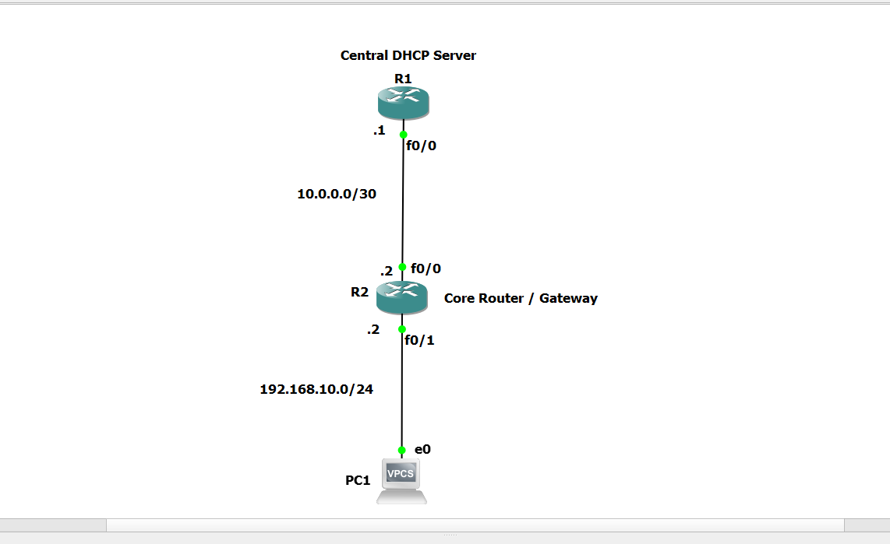

Markdown

# Lab 1: Centralized Router-Based DHCP & DHCP Relay Agent (`ip helper-address`)

## 📝 Overview
In enterprise networks, DHCP servers are typically centralized in a dedicated management subnetwork rather than deployed locally on every broadcast domain. Because DHCP discovery packets are Layer 2 broadcasts (`255.255.255.255`), routers block them by default. 

This lab demonstrates configuring a **Centralized Cisco Router DHCP Server** and implementing **DHCP Relay Agent (`ip helper-address`)** on the local gateway to forward DHCP requests across subnets.

---

## 🗺️ Network Topology



---

## 🔑 Key Concepts Covered
* **Centralized IP Management:** Centralizing IP pool assignments across multiple subnets/VLANs.
* **Broadcast-to-Unicast Forwarding:** Utilizing `ip helper-address` to relay UDP port 67/68 traffic across Layer 3 boundaries.
* **Address Exclusion:** Reserving infrastructure and static IPs from dynamic pools.

---

## 💻 CLI Configuration Summary

### Central DHCP Server Configuration
```text
ip dhcp excluded-address 192.168.10.1 192.168.10.10

ip dhcp pool SALES_POOL
 network 192.168.10.0 255.255.255.0
 default-router 192.168.10.1
 dns-server 8.8.8.8

Core Router / Relay Configuration
Plaintext

interface fastEthernet 0/1
 ip address 192.168.10.1 255.255.255.0
 ip helper-address 10.0.0.1

🧪 Verification Commands
Plaintext

# View Active Leases on Server
R1_DHCP_Server# show ip dhcp binding

# Inspect DHCP Pool Status
R1_DHCP_Server# show ip dhcp pool

# Check DHCP Server Counters
R1_DHCP_Server# show ip dhcp server statistics

